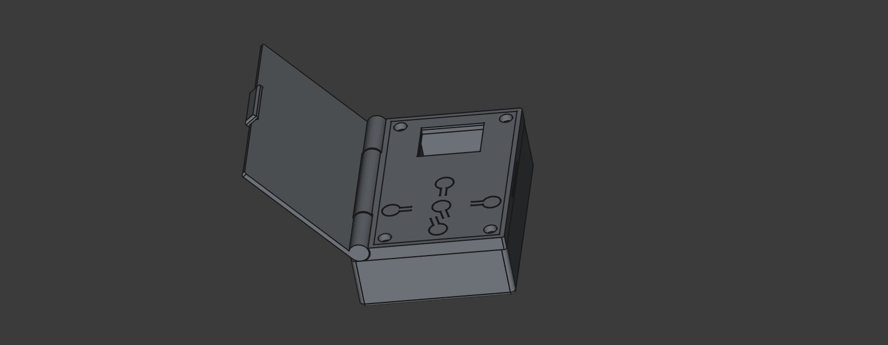

# Enclosure

Welcome to the enclosure section of the beer tracker. This enclosure can be
made via a 3D printer. I recommend NOT using PLA, but rather PETG or ASA.
The enclosure will be more robust this way.

If you just want to print it and not modify it, then you can use the provided
STL files located in the `stl` folder. (Yes you need to print all 3).

If you want to modify the files you can open the projectfile (`BeerTracker.FCStd`)
with FreeCAD.

## Additional Material

- 4x M3 Screws
- 4x M3 Nuts

## 3D - Assembly

## How to assemble

1. Insert the button cover inside the lid.
2. Insert the nut into the case from the bottom. (Make sure that nut is oriented correctly,
    - Tip: If you have a longer M3 screw, then insert it from the top of the case and then screw on the nut. After that you can use a hammer to insert the nut from the bottom. The screw will keep the nut straight.)
3. Insert the PCB into the button cover.
4. Sandwich the two halfs
5. Done.
